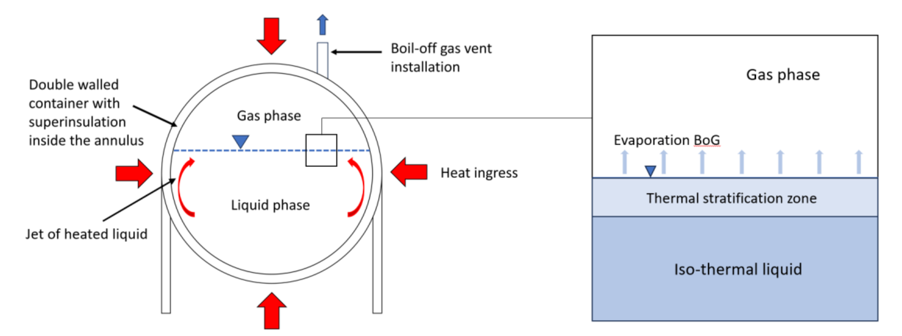
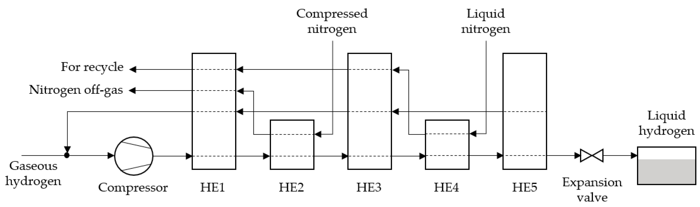
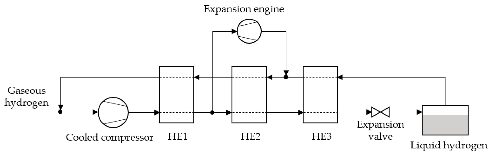
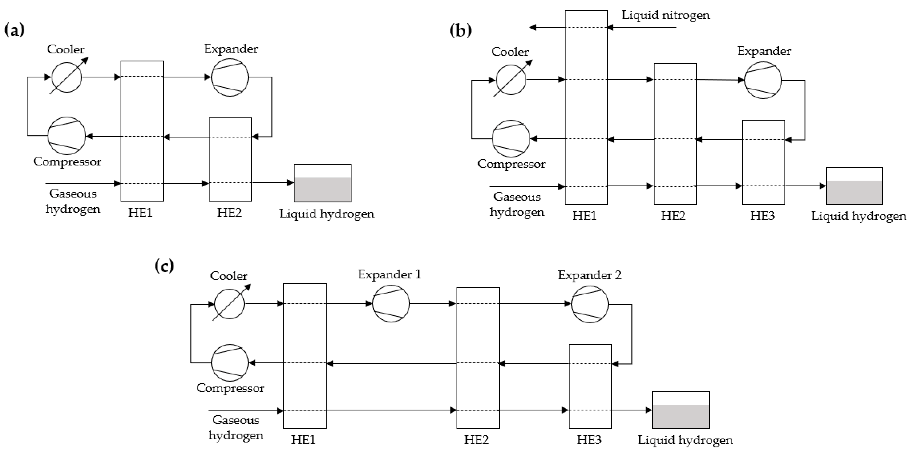

# Principio de operación 

## Principios de operación fundamentales 

El almacenamiento de hidrógeno líquido es un proceso criogénico que requiere mantener el hidrógeno a temperaturas extremadamente bajas. A continuación, se detallan los principios fundamentales de este proceso.

En primer lugar, el almacenamiento de L2H depende completamente de las propiedades termodinámicas del hidrógeno, notablemente de su temperatura de ebullición y su densidad energética. A presión atmosférica el hidrógeno se encuentra en estado gaseoso, ya que tiene un punto de ebullición de -252,87°C. Por lo tanto, para mantener el hidrógeno en estado líquido se necesitan temperaturas criogénicas. Luego, a pesar de que el hidrógeno líquido tiene una densidad mucho menor que los combustibles fósiles, es significativamente más denso que el hidrógeno gaseoso, lo que lo hace útil para almacenamiento eficiente de hidrógeno [16].

En segundo lugar, la molécula de hidrógeno existe en dos isómeros diferentes: orto-hidrógeno (menos estable) y para-hidrógeno (más estable). La diferencia entre estos isómeros es la dirección del giro de su núcleo, y sus energías rotacionales, siendo o-H2 el nivel de energía más alto.

A 25 °C, el H2 molecular se compone de 75% de o-H2 y 25% de p-H2. El equilibrio entre los estados depende de la temperatura y se desplaza hacia 100% de p-H2 a medida que la temperatura disminuye a −253 °C. Este desplazamiento se denomina conversión orto-a-para (OPC). La entalpía de OPC es de 527 kJ/kg, y el calor de vaporización de p-H2 es aproximadamente 447 kJ/kg. Esta entalpía de conversión exotérmica es un trabajo adicional que aumenta el trabajo reversible total en aproximadamente un 15%. Es decir, durante la licuefacción, OPC genera calor, representando un desafío adicional para los sistemas de enfriamiento criogénico [16].

En tercer lugar, las pérdidas de hidrógeno por evaporación, llamadas *boil-off* se deben reducir al máximo. El *boil-off* es la evaporación lenta y continua de gases licuados causada por el intercambio de calor con el entorno, que aumenta la presión en el tanque de almacenamiento y genera pérdidas de hidrógeno líquido. Este fenómeno es crítico debido a la baja temperatura requerida (-253 °C) y el alto consumo energético para su producción (11 % del contenido energético del hidrógeno). Factores como fugas térmicas, agitación del líquido (sloshing), transferencia entre tanques a diferentes presiones y la OPC contribuyen al *boil-off*. Entonces, debido a la constante transferencia de calor hacia el sistema, los tanques de almacenamiento de hidrógeno líquido deben estar aislados térmicamente para reducir las pérdidas por *boil-off*. Sin embargo, si llega a ocurrir esta pérdida, el gas evaporado puede ser capturado y reutilizado, ayudando a minimizar las pérdidas y a mejorar la eficiencia energética [16].

En cuarto lugar, se requiere un diseño de tanques criogénicos eficiente, para minimizar las pérdidas de hidrógeno. Actualmente, los tanques de almacenamiento de hidrógeno líquido generalmente son de doble pared: tienen una pared interna que contiene el hidrógeno y una pared externa que entrega el aislamiento térmico. El espacio entre las paredes internas y externas se mantiene al vacío para minimizar la transferencia de calor por conducción y convección. Además, los materiales utilizados en la construcción de estos tanques son elegidos cuidadosamente, ya que deben resistir los esfuerzos térmicos y mecánicos causados por los cambios de temperatura. Eventualmente, para el aislamiento activo, se puede introducir un sistema de refrigeración y almacenamiento interno (IRAS) que utilice helio como refrigerante y como aislamiento pasivo. Las burbujas de vidrio también se han evaluado como un material de aislamiento potencial, ya que muestran un mejor rendimiento que el polvo de perlita [16].

En quinto lugar, es importante controlar a la presión dentro del tanque. Efectivamente, a medida que el hidrógeno líquido absorbe calor, se convierte en gas, lo que aumenta la presión dentro del tanque por su expansión térmica. Para liberar el gas generado y mantener la presión dentro de límites seguros se necesitan válvulas de alivio. El gas de *boil-off* recuperado por las válvulas puede ser reciclado o utilizado para otros fines [16].

En sexto lugar, se debe considerar la seguridad operacional de tratar con tanques de hidrógeno. El hidrógeno es extremadamente inflamable, por lo que los sistemas deben estar diseñados para prevenir fugas y mantener las concentraciones de hidrógeno dentro de rangos seguros. Además, los sistemas de almacenamiento de hidrógeno deben contar con sensores y válvulas que permitan una ventilación controlada en caso de acumulaciones de gas [16].

En séptimo lugar, para que sea sostenible y factible usar este tipo de almacenamiento, se deben tener consideraciones ambientales y económicas. La licuefacción de hidrógeno es un proceso que consume una cantidad significativa de energía, por lo que no necesariamente es lo más ideal. Para remediar este inconveniente, se están desarrollando tecnologías para hacer este proceso más eficiente. Por lo mismo, aunque el hidrógeno líquido es una opción eficiente para el almacenamiento y transporte, se deben considerar los impactos ambientales del proceso de licuefacción. Para esto, se podría eventualmente hacer un análisis de ciclo de vida (LCA) para saber si realmente conviene o no transportar al hidrógeno como LH2 [16].

## Funcionamiento técnico
El funcionamiento técnico de la unidad de proceso de almacenamiento de hidrógeno líquido involucra una serie de pasos y equipos diseñados para mantener el hidrógeno en estado líquido a temperaturas criogénicas, a la vez que gestionan los aspectos de presión, evaporación y eficiencia energética.

En primer lugar, para obtener el hidrógeno líquido se debe realizar el proceso de licuefacción de hidrógeno gaseoso. El hidrógeno gaseoso se licúa mediante un proceso que implica su compresión y posterior enfriamiento a temperaturas extremadamente bajas. Primero, ocurre una compresión inicial en la cual el hidrógeno gaseoso es comprimido a presiones de alrededor de 20-30 MPa. Este paso aumenta la densidad del gas, lo que facilita el proceso de enfriamiento posterior. Segundo, se realiza el enfriamiento criogénico del gas comprimido. Este se enfría utilizando ciclos de refrigeración basados en ciclos de expansión de gases criogénicos, como nitrógeno o helio. Este proceso reduce la temperatura del hidrógeno a -253°C, punto de ebullición del hidrógeno, lo que permite que el gas se convierta en líquido [16].

En segundo lugar, una vez que el hidrógeno está licuado, se almacena en tanques de almacenamiento criogénicos. Estos tanques son esenciales para mantener el hidrógeno en estado líquido y están diseñados con características específicas, como ya se mencionó previamente. Los tanques suelen tener dos capas: una interna, que contiene el LH2, y una externa para el aislamiento térmico. El espacio entre las dos paredes está al vacío para reducir la transferencia de calor por conducción y convección. Por lo mismo, los tanques están diseñados para minimizar las pérdidas térmicas, utilizando materiales como espuma aislante y capas reflectantes. La eficiencia del aislamiento es crucial para reducir la cantidad de hidrógeno que se evapora debido al calor del ambiente exterior [16].

En tercer lugar, se debe regular la presión por el fenómeno del *boil-off*. Dado que el hidrógeno líquido absorbe calor con el tiempo, se convierte en gas, aumentando la presión en el tanque. El gas generado por el *boil-off* se puede reciclar y utilizarse nuevamente o convertirse en gas comprimido para otras aplicaciones. Los sistemas de válvulas de alivio de presión permiten liberar gas cuando la presión interna alcanza niveles peligrosos [16].

En cuarto lugar, el hidrógeno líquido almacenado debe ser transportado y distribuido de manera segura. Se utilizan camiones cisterna criogénicos o barcos especializados para transportar el hidrógeno líquido a su destino. Estos vehículos están equipados con sistemas de aislamiento avanzados para garantizar que el hidrógeno se mantenga en estado líquido durante el transporte [16].

En quinto lugar, se aprovecha de recuperar y reutilizar la energía generada en el proceso. En algunos sistemas avanzados, se pueden utilizar las temperaturas extremadamente bajas del hidrógeno líquido para recuperar parte de la energía a través de procesos como la refrigeración o generación de electricidad mediante ciclos de turbinas criogénicas [16].

## Ejemplos
Hoy en día, existen varias tecnologías de licuefacción con sus ventajas y desventajas correspondientes, que incluyen al proceso de Linde, el proceso de Claude, el proceso de Collins, el ciclo de Brayton con helio, y la refrigeración magnética [18]. 

En primer lugar, el proceso de Linde utiliza el principio de expansión Joule–Thomson, en el cual un gas se enfría al expandirse sin realizar trabajo externo. El hidrógeno se comprime inicialmente a presiones elevadas (alrededor de 200-300 bar) y se enfría en un intercambiador de calor utilizando un ciclo de refrigeración previo, generalmente con nitrógeno líquido o mezclas refrigerantes. La expansión ocurre a través de una válvula de estrangulamiento, lo que permite alcanzar temperaturas suficientemente bajas como para licuar el hidrógeno. Sin embargo, este método tiene un consumo energético relativamente alto debido a la dependencia de pre-refrigerantes externos y las ineficiencias en el manejo del gradiente térmico. Este método es más adecuado para plantas pequeñas o medianas [18].

En segundo lugar, el proceso de Claude mejora la eficiencia del método de Linde al incorporar turbinas de expansión. Estas turbinas no solo enfrían el hidrógeno comprimido mediante la expansión, sino que también recuperan energía mecánica, que puede utilizarse para reducir el trabajo en los compresores. El proceso comienza con la compresión del hidrógeno a alrededor de 200 bar y un pre-enfriamiento mediante ciclos secundarios con nitrógeno líquido. Posteriormente, el hidrógeno se enfría en etapas sucesivas dentro de intercambiadores de calor y turbinas, alcanzando temperaturas criogénicas (~-253 °C). Las mejoras en la eficiencia energética lo hacen una opción popular para plantas de licuefacción de mediana escala [18].

En tercer lugar, el proceso de Collins es una variante más compleja del proceso de Claude, diseñado para manejar mayores capacidades. Introduce múltiples etapas de expansión y recuperación térmica mediante intercambiadores de calor en cascada. En este sistema, cada etapa de expansión utiliza turbinas que trabajan a diferentes rangos de temperatura y presión, permitiendo un enfriamiento progresivo más eficiente del hidrógeno. Adicionalmente, se optimizan las tasas de transferencia de calor y los gradientes térmicos, reduciendo las pérdidas energéticas. Este proceso es particularmente útil en aplicaciones industriales de alta capacidad, donde se busca maximizar la eficiencia y minimizar los costos operativos [18].

En cuarto lugar, el ciclo de Brayton utiliza helio como fluido refrigerante primario debido a sus propiedades termodinámicas ideales a bajas temperaturas. El ciclo comienza comprimiendo el helio y luego enfriándolo mediante intercambiadores de calor que utilizan nitrógeno líquido como pre-enfriante. Posteriormente, el helio se expande en turbinas criogénicas, lo que permite absorber calor del hidrógeno a medida que este se enfría y se licua. Este método ofrece una eficiencia energética superior, ya que el helio puede ser reciclado de manera continua dentro del sistema. Es ideal para plantas de gran escala y aplicaciones que requieren altos volúmenes de hidrógeno líquido [18].

En quinto lugar, la refrigeración magnética se basa en el efecto magnetocalórico, donde ciertos materiales absorben o liberan calor cuando son sometidos a cambios en campos magnéticos. A medida que los materiales alternan entre magnetización y desmagnetización, se produce un efecto de enfriamiento que puede reducir las temperaturas a niveles criogénicos sin necesidad de fluidos refrigerantes como el helio. Aunque esta tecnología tiene el potencial de ser más eficiente energéticamente que los ciclos de refrigeración tradicionales, actualmente enfrenta desafíos en términos de escalabilidad, materiales especializados y generación de campos magnéticos de alta intensidad. Es una tecnología en desarrollo con aplicaciones prometedoras a futuro [18].

