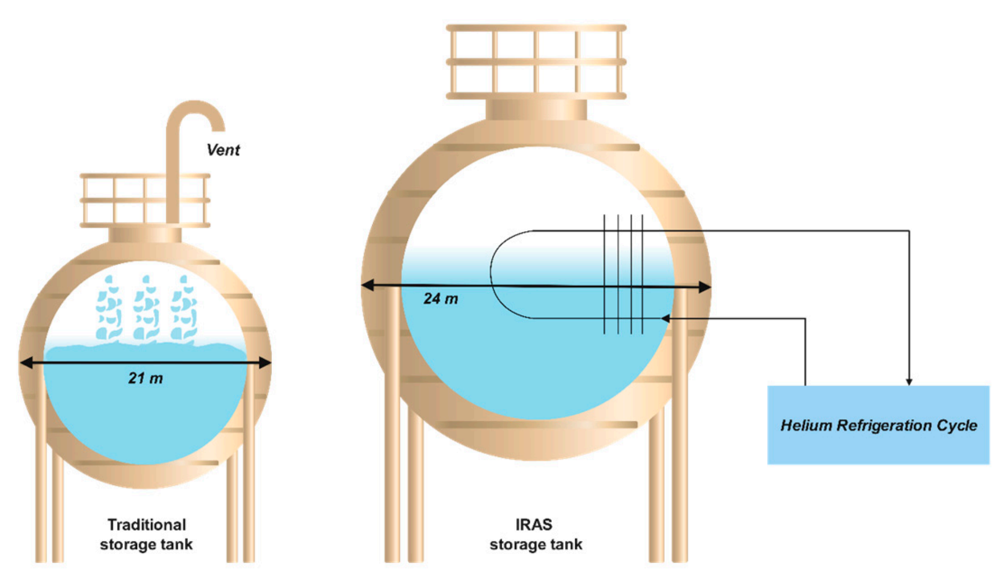

# Principio de operación 

## Principios de operación fundamentales 

El almacenamiento de hidrógeno líquido es un proceso criogénico que requiere mantener el hidrógeno a temperaturas extremadamente bajas. A continuación, se detallan los principios fundamentales de este proceso.

En primer lugar, el almacenamiento de L2H depende completamente de las propiedades termodinámicas del hidrógeno, notablemente de su temperatura de ebullición y su densidad energética. A presión atmosférica el hidrógeno se encuentra en estado gaseoso, ya que tiene un punto de ebullición de -252,87°C. Por lo tanto, para mantener el hidrógeno en estado líquido se necesitan temperaturas criogénicas. Luego, a pesar de que el hidrógeno líquido tiene una densidad mucho menor que los combustibles fósiles, es significativamente más denso que el hidrógeno gaseoso, lo que lo hace útil para almacenamiento eficiente de hidrógeno [16].

En segundo lugar, la molécula de hidrógeno existe en dos isómeros diferentes: orto-hidrógeno (menos estable) y para-hidrógeno (más estable). La diferencia entre estos isómeros es la dirección del giro de su núcleo, y sus energías rotacionales, siendo o-H2 el nivel de energía más alto.

A 25 °C, el H2 molecular se compone de 75% de o-H2 y 25% de p-H2. El equilibrio entre los estados depende de la temperatura y se desplaza hacia 100% de p-H2 a medida que la temperatura disminuye a −253 °C. Este desplazamiento se denomina conversión orto-a-para (OPC). La entalpía de OPC es de 527 kJ/kg, y el calor de vaporización de p-H2 es aproximadamente 447 kJ/kg. Esta entalpía de conversión exotérmica es un trabajo adicional que aumenta el trabajo reversible total en aproximadamente un 15%. Es decir, durante la licuefacción, OPC genera calor, representando un desafío adicional para los sistemas de enfriamiento criogénico [16].

En tercer lugar, las pérdidas de hidrógeno por evaporación, llamadas *boil-off* se deben reducir al máximo. El *boil-off* es la evaporación lenta y continua de gases licuados causada por el intercambio de calor con el entorno, que aumenta la presión en el tanque de almacenamiento y genera pérdidas de hidrógeno líquido. Este fenómeno es crítico debido a la baja temperatura requerida (-253 °C) y el alto consumo energético para su producción (11 % del contenido energético del hidrógeno). Factores como fugas térmicas, agitación del líquido (sloshing), transferencia entre tanques a diferentes presiones y la OPC contribuyen al *boil-off*. Entonces, debido a la constante transferencia de calor hacia el sistema, los tanques de almacenamiento de hidrógeno líquido deben estar aislados térmicamente para reducir las pérdidas por *boil-off*. Sin embargo, si llega a ocurrir esta pérdida, el gas evaporado puede ser capturado y reutilizado, ayudando a minimizar las pérdidas y a mejorar la eficiencia energética [16].

En cuarto lugar, se requiere un diseño de tanques criogénicos eficiente, para minimizar las pérdidas de hidrógeno. Actualmente, los tanques de almacenamiento de hidrógeno líquido generalmente son de doble pared: tienen una pared interna que contiene el hidrógeno y una pared externa que entrega el aislamiento térmico. El espacio entre las paredes internas y externas se mantiene al vacío para minimizar la transferencia de calor por conducción y convección. Además, los materiales utilizados en la construcción de estos tanques son elegidos cuidadosamente, ya que deben resistir los esfuerzos térmicos y mecánicos causados por los cambios de temperatura. Eventualmente, para el aislamiento activo, se puede introducir un sistema de refrigeración y almacenamiento interno (IRAS) que utilice helio como refrigerante y como aislamiento pasivo. Las burbujas de vidrio también se han evaluado como un material de aislamiento potencial, ya que muestran un mejor rendimiento que el polvo de perlita [16].

En quinto lugar, es importante controlar a la presión dentro del tanque. Efectivamente, a medida que el hidrógeno líquido absorbe calor, se convierte en gas, lo que aumenta la presión dentro del tanque por su expansión térmica. Para liberar el gas generado y mantener la presión dentro de límites seguros se necesitan válvulas de alivio. El gas de *boil-off* recuperado por las válvulas puede ser reciclado o utilizado para otros fines [16].

En sexto lugar, se debe considerar la seguridad operacional de tratar con tanques de hidrógeno. El hidrógeno es extremadamente inflamable, por lo que los sistemas deben estar diseñados para prevenir fugas y mantener las concentraciones de hidrógeno dentro de rangos seguros. Además, los sistemas de almacenamiento de hidrógeno deben contar con sensores y válvulas que permitan una ventilación controlada en caso de acumulaciones de gas [16].

En séptimo lugar, para que sea sostenible y factible usar este tipo de almacenamiento, se deben tener consideraciones ambientales y económicas. La licuefacción de hidrógeno es un proceso que consume una cantidad significativa de energía, por lo que no necesariamente es lo más ideal. Para remediar este inconveniente, se están desarrollando tecnologías para hacer este proceso más eficiente. Por lo mismo, aunque el hidrógeno líquido es una opción eficiente para el almacenamiento y transporte, se deben considerar los impactos ambientales del proceso de licuefacción. Para esto, se podría eventualmente hacer un análisis de ciclo de vida (LCA) para saber si realmente conviene o no transportar al hidrógeno como LH2 [16].

## Funcionamiento técnico

